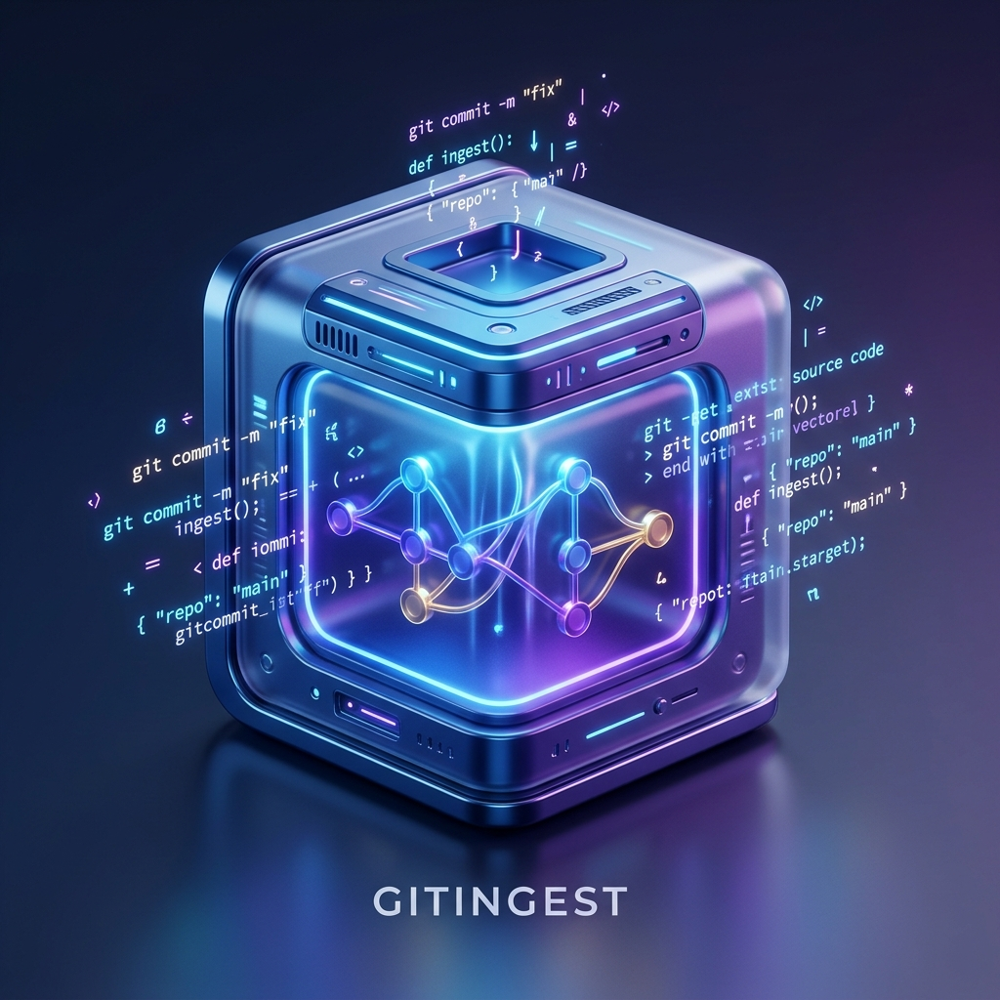

# 🚀 GitingestUI

**GitingestUI** is a modern, lightweight C++ desktop application designed to transform any codebase—local or remote—into a single, LLM-ready text digest. Whether you're working with private repositories or local folders, GitingestUI makes it easy to "ingest" code for use with ChatGPT, Claude, and other Large Language Models.

<p align="center">
  
</p>

---

## ✨ Key Features

-   🌐 **Remote & Local Ingestion**: Clone any public or private GitHub repository, or simply select a folder on your hard drive.
-   🌳 **Interactive File Tree**: Visually browse your project and toggle specific files or folders to include/exclude them from the digest.
-   🔒 **Secure Token Management**: Safely store your GitHub Personal Access Tokens using Windows **DPAPI encryption**. Your tokens never leave your machine in plain text.
-   🔢 **Token Estimation**: Built-in token counter using `tiktoken` to help you manage LLM context windows.
-   🛡️ **Smart Filtering**: Automatically respects `.gitignore` rules and allows for custom glob-pattern based inclusions and exclusions.
-   🌍 **Multilingual**: Native support for **English** and **French**.
-   🎨 **Modern UI**: Dark-themed, responsive interface built with Dear ImGui and OpenGL 3.

## 🛠️ Getting Started

### Prerequisites

-   **Windows 10/11** (Currently Windows-focused for security features)
-   **CMake** (3.16+)
-   **C++ Compiler** (MSVC 2019+ recommended)
-   **Git** installed and available in your PATH

### Building from Source

1.  **Clone the repository**:
    ```bash
    git clone https://github.com/KLM-corporation/gitingest-ui.git
    cd gitingest-ui
    ```

2.  **Generate and build**:
    ```bash
    mkdir build
    cd build
    cmake ..
    cmake --build . --config Release
    ```

The build process will automatically download necessary dependencies (GLFW, ImGui) and a portable Python environment for tokenization.

## 🔒 Security & Privacy

GitingestUI is built with privacy in mind:
-   **All processing is local**: No code is ever sent to a third-party server (except when cloning from GitHub).
-   **Secure Storage**: On Windows, sensitive data like GitHub tokens are encrypted using your user account credentials via DPAPI.
-   **Transparent Temp Files**: Cloned repositories are stored in a temporary folder (`.gitingest_temp`) and purged automatically.

## 📜 License

This project is licensed under the **MIT License** - see the [LICENSE](LICENSE) file for details.

---

*Developed by [KLM-corporation](https://github.com/KLM-corporation)*
